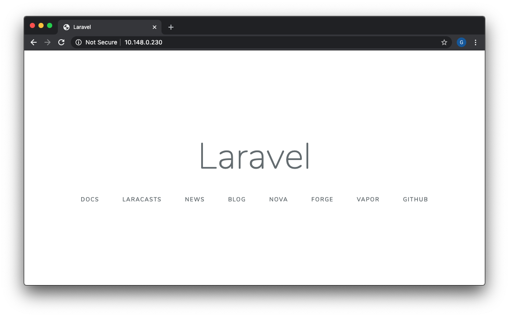

In the [previous articles](https://gibransvarga.com/architecting-a-highly-available-apps-part-1/) we have managed architecture for High Availability applications with Docker using GlusterFS Replicated Volume. Now it’s time to get into more specifics by Orchestrate Laravel application with Docker Swarm and then test if this setup is resilient to VM failure.

We're going to create a new docker image for the Laravel Project, and then define the entire stack configuration in a `Docker Compose` file that contains some services including the App/Laravel, Nginx, and MySQL database.

For those who don’t know what Docker is, let’s enjoy a brief overview. According to opensource.com:
> [Docker](https://www.docker.com/) is a tool designed to make it easier to create, deploy, and run applications by using containers. Containers allow a developer to package up an application with all of the parts it needs, such as libraries and other dependencies, and ship it all out as one package.

Sound exciting? **Let’s dive in!**

## Prerequisites

Before we proceed, take a moment to make sure you have everything in place for us to get started

1. Docker installed on your machine. [Click here to install](https://docs.docker.com/engine/install/ubuntu/).
2. GlusterFS installed on your worker machine, following my [previous article](https://gibransvarga.com/highly-available-applications-docker-swarm/).
3. Create the `app-storage` and `dbs-storage` directory's for the container volume inside `/mnt/swarm` path on your swarm-worker hosts.

## Directory structure

The directory structure of the application will look as follows:

```
app
├── configs/
│   └── my.cnf
│   └── default.conf
├── laravel-app/
│   └── (Laravel app files)
├── docker-stack.yml
└── Dockerfile
```

## Creating the Docker Cluster

First step, we will create the swarm cluster of our nodes. To create the swarm cluster, we need to initialize the swarm mode on the `swarm-manager` node and then join the `swarm-worker-1`, `swarm-worker-2` and `swarm-worker-3` node to the cluster.

Initialize the Docker Swarm mode by running the following docker command on the `swarm-manager` node and using the swarm-manager’s private IP as the `advertised address`:

```language-shell-session
[swarm-manager ~]$ docker swarm init --advertise-addr 10.148.0.227
Swarm initialized: current node (t8u69vlje325z8qqfp9uixecl) is now a manager.

To add a worker to this swarm, run the following command:

    docker swarm join --token SWMTKN-1-1u2r5vkhiz2607rsn89su6xzvgpoc83uh5dog8m5hzzz9dp29p-7fhq1or275il3y8qr00xopetd 10.148.0.227:2377

To add a manager to this swarm, run 'docker swarm join-token manager' and follow the instructions.
```

Now, to join the worker nodes to the swarm, we will run the `docker swarm join` command on all worker nodes which we received in the swarm initialization step:

```language-shell-session
[swarm-worker-1 ~]$ docker swarm join --token SWMTKN-1-1u2r5vkhiz2607rsn89su6xzvgpoc83uh5dog8m5hzzz9dp29p-7fhq1or275il3y8qr00xopetd 10.148.0.227:2377
This node joined a swarm as a worker.

[swarm-worker-2 ~]$ docker swarm join --token SWMTKN-1-1u2r5vkhiz2607rsn89su6xzvgpoc83uh5dog8m5hzzz9dp29p-7fhq1or275il3y8qr00xopetd 10.148.0.227:2377
This node joined a swarm as a worker.

[swarm-worker-3 ~]$ docker swarm join --token SWMTKN-1-1u2r5vkhiz2607rsn89su6xzvgpoc83uh5dog8m5hzzz9dp29p-7fhq1or275il3y8qr00xopetd 10.148.0.227:2377
This node joined a swarm as a worker.
```

To see the node status, so that we can determine if the nodes are active/available etc, from the manager node, list all the nodes in the swarm:

```language-shell-session
[swarm-manager ~]$ docker node ls
ID                            HOSTNAME            STATUS      AVAILABILITY      MANAGER STATUS      ENGINE VERSION
t8u69vlje325z8qqfp9uixecl *   swarm-manager       Ready       Active            Leader              19.03.8
0tejvcyjo6ci0ejw17oz2yd56     swarm-worker-1      Ready       Active                                19.03.8
npgpquu5nise5tyalurdv75ve     swarm-worker-2      Ready       Active                                19.03.8
hxt5x38krno7k293dv62nyfc4     swarm-worker-3      Ready       Active                                19.03.8
```

## Create Private Registry

In this part we will create a private **Registry** to store our container images locally. If you want to use a hosted one such as [Docker Hub](https://hub.docker.com/), [Google Container Registry](https://cloud.google.com/container-registry), [Amazon ECR](https://aws.amazon.com/ecr/), etc. you can skip this part

To run registry service, execute command below:

```
docker service create --name registry --publish published=5000,target=5000 -e REGISTRY_STORAGE_DELETE_ENABLED=true registry:latest
```

To recap, we are starting a container service named `registry` based on the `registry` latest image and the registry API expects to be consumed on port `5000`. And the `-e` means to set environment variables `REGISTRY_STORAGE_DELETE_ENABLED` to `true` in `registry` container to allows you delete images from the registry.

Actually we can develop Docker Registry which is equipped with secure and authentication protocol, but this article is not discussed because it will be too long. If you are interested, you can learn it through the following [Docker documentation](https://docs.docker.com/registry/configuration/).

## Clone Laravel Project

Now, we're going to clone the latest version of Laravel Project from their [Github](https://github.com/laravel/laravel.git) and then install Laravel dependencies using the PHP `composer` docker image:

```git
mkdir ~/app
git clone https://github.com/laravel/laravel.git ~/app/laravel-app
cd ~/app/laravel-app
```

Now run the following docker command in order to install Laravel dependencies:

```
docker run --rm -v $(pwd):/app composer install
```

Using the `--rm` and `-v` flags with docker run creates an ephemeral container that will be bind-mounted to your current directory before being removed. This will copy the contents of your `~/laravel-app` directory to the container and also ensure that the vendor directory Composer creates inside the container is copied to your current directory.

Once the Laravel dependencies installation is finished, we must change the owner of `laravel-app` directory to our own user using sudo command below:

```language-shell-session
[swarm-manager app]$ sudo chown -R $USER:$USER ~/app/laravel-app
```

## Build Our Stack
### Creating the Docker Compose

A great rule of thumb when using Docker is that each container should provide a single service. Since we’re creating a typical LEMP stack, that means we’ll need one for our web server **Nginx**, **PHP**, and **MySQL**. While theoretically we could create individual containers for each of these services and then attempt to link them together, Docker has a beautiful built-in tool for this called [docker-compose](https://docs.docker.com/compose/).

To get started, we specify that we want to use version 3.7 of docker compose in first line `docker-stack.yml` file. Then create some `services`, `network`, `volumes` and `configs` to use between containers.

```yaml
version: "3.7"

services:

networks:
  laravel-net:
    driver: overlay

volumes:
  app-storage:
    driver: local
    driver_opts:
      type: none
      o: bind
      device: "/mnt/swarm/app-storage"
  dbs-storage:
    driver: local
    driver_opts:
      type: none
      o: bind
      device: "/mnt/swarm/dbs-storage"

configs:
  nginx-config:
    name: nginx-config
    file: ./configs/nginx-default.conf
  mysql-config:
    name: mysql-config
    file: ./configs/my.cnf
```

**Services:** Where we’ll specify the images that’ll make up our stack.

**Networks:** To facilitate communication between containers, the services are connected to a overlay network called `laravel-net`. Because The only way to let containers running on different hosts connect to each other is by using an overlay network. It can be thought of as a container network that is built on top of another network (in this case, the physical hosts network). Docker Swarm mode comes with a default overlay network which implements a `VxLAN-based` solution with the help of `libnetwork` and `libkv`. You can however choose another overlay network driver like `Flannel`, `Calico` or `Weave` where extra installation steps are necessary.

**Volumes:** Docker has powerful and convenient features for persisting data. In our application, we will make use of `volumes` and `bind mounts` for persisting the database, and application. Volumes offer flexibility for backups and persistence beyond a container’s lifecycle, while bind mounts facilitate code changes during development, making changes to your host files or directories immediately available in your containers. Our setup will make use of both.

**Configs:** Is use to store non-sensitive information, such as `configuration files` outside a service’s image or running containers. This allows us to keep our images as generic as possible, without the need to `bind-mount` configuration files into the containers or use environment variables.

Directly under the `services` heading that we specified at the bottom of the `docker-stack.yml` file above, lets start by adding our main app container.

```yaml
app:
  image: 127.0.0.1:5000/app
  volumes: 
    - "app-storage:/var/www"
  networks:
    - laravel-net
  deploy:
    mode: 'replicated'
    replicas: 1
    placement:
      constraints: [node.role == worker]
    update_config:
      parallelism: 2
      delay: 5s
      order: stop-first
    restart_policy:
      condition: on-failure
```

Details of the Laravel container service:

- The Laravel container service will be named as `app`. It's based on our custom docker image that will be created with our `Dockerfile` and we store to Private Registry later.
- The service will mount the `app-storage` directory on our swarm worker to the `/var/www` inside the container service.
- The service will using the custom docker network for our setup, the network will be named as `laravel-net`.

Next, we will build Nginx container. Instead of installing manually, we will simply use the [official Nginx docker image](https://hub.docker.com/_/nginx/).

```yaml
nginx:
  image: nginx:alpine
  configs:
    - source: nginx-config
      target: /etc/nginx/conf.d/default.conf
  volumes: 
    - "app-storage:/var/www"
  networks:
    - laravel-net
  ports:
    - "80:80"
    - "443:443"
  deploy:
    mode: 'replicated'
    replicas: 2
    placement:
      constraints: [node.role == worker]
    update_config:
      parallelism: 2
      delay: 5s
      order: stop-first
    restart_policy:
      condition: on-failure
```

Details of the Nginx container service:

- We are using `nginx:alpine` docker image to build the container.
- The service will open the `HTTP` and `HTTPS` ports.
- The service will mount the `app-storage` directory to `/var/www` in the container. And also store `Nginx` configuration to the container.
- The service will using the custom docker network for our setup, the network will be named as `laravel-net`.

Lastly, we will create the mysql container. We will use [official MySQL docker image](https://hub.docker.com/_/mysql/).

```yaml
dbs:
  image: mysql:5.7.22
  configs:
    - source: mysql-config
      target: /etc/mysql/my.cnf
  command: --default-authentication-plugin=mysql_native_password
  environment:
    MYSQL_ROOT_PASSWORD: secret
    MYSQL_USER: homestead
    MYSQL_DATABASE: homestead
    MYSQL_PASSWORD: secret
  volumes: 
    - "dbs-storage:/var/lib/mysql"
  networks:
    - laravel-net
  deploy:
    mode: 'replicated'
    replicas: 1
    placement:
      constraints: [node.role == worker]
    update_config:
      parallelism: 2
      delay: 5s
      order: stop-first
    restart_policy:
      condition: on-failure
```

Details of the MySQL container service:

- The MySQL container service will be named as `dbs`, based on the `mysql:5.7.22` docker image.
- The service will run the `mysql_native_password` plugin to specifying that the database should be run with native password authentication enables.
- We set some environment variables which will be used by `mysql container`. When the container starts, `homestead` database will be created with the specified `user`, `password` and `root password`. We will use this details later to connect to the mysql database.
- The service will mount the `dbs-storage` directory to `/var/lib/mysql` in the container to retain the data even after the container is destroyed. And also store `MySQL` configuration to the container.
- The service will using the custom docker network for our setup, the network will be named as `laravel-net`.

Following is our final `laravel-docker-stack.yml` file.

<Gist gistLink="slovenski/e936b40af302ee277e1aa7dfbabf2ebe"/>
<br />

### Creating the Dockerfile

Lets start writing Dockerfile and build our PHP container.
Our `Dockerfile` uses `php:7.2-fpm` docker image as base and set the maintainer details.

```dockerfile
FROM php:7.2-fpm
LABEL maintainer="Gibran Svarga <contact.gibransvarga@gmail.com>"
```

Copy `composer.lock` and `composer.json` to `/var/www` directory and specifies the `/var/www` directory as the working directory for the application using `WORKDIR` instruction.

```dockerfile
COPY laravel-app/composer.lock /var/www/
COPY laravel-app/composer.json /var/www/

WORKDIR /var/www
```

Use the `RUN` command to determine the container resources at runtime to update the apt repository and install the dependencies needed by Laravel and Composer then delete the `apt cache`.

```dockerfile
RUN apt-get update && apt-get install -y \
    build-essential libpng-dev libjpeg62-turbo-dev \
    libfreetype6-dev locales zip jpegoptim optipng pngquant gifsicle \
    vim unzip git curl

RUN apt-get clean && rm -rf /var/lib/apt/lists/*
```

PHP-fpm container comes with a utility script `docker-php-ext-install` that helps to install PHP extensions. We use that script to install `pdo_mysql` extension which is required by Laravel to connect to mysql database. We also installs the other prerequisite packages such: `mcrypt`, `mbstring`, and `imagick` with `composer`.

```dockerfile
RUN docker-php-ext-install pdo_mysql mbstring zip exif pcntl
RUN docker-php-ext-configure gd --with-gd --with-freetype-dir=/usr/include/ --with-jpeg-dir=/usr/include/ --with-png-dir=/usr/include/
RUN docker-php-ext-install gd

RUN curl -sS https://getcomposer.org/installer | php -- --install-dir=/usr/local/bin --filename=composer
```

Creating a dedicated user and group with restricted permissions mitigates the inherent vulnerability when running Docker containers, which run by default as `root`.

```dockerfile
RUN groupadd -g 1000 www
RUN useradd -u 1000 -ms /bin/shell -g www www

COPY laravel-app/ /var/www
COPY --chown=www:www laravel-app/ /var/www

USER www
```

Finally, the `EXPOSE` command exposes a port in the container `9000` for the `php-fpm` server. `CMD` specifies the command that should run once the container is created. Here, CMD specifies `"php-fpm"`, which will start the server.

```dockerfile
EXPOSE 9000
CMD ["php-fpm"]
```

Make sure you create the `Dockerfile` outside `laravel-app` directory. So, our final Dockerfile looks as follows.

<Gist gistLink="slovenski/e7c7ccce2ea43f65f12be672ab9f868e"/>
<br />

### Nginx Configuration

Following is our [Nginx](https://nginx.org/en/) configuration. Everything in this file is usual Nginx configuration except for `fastcgi_pass app:9000;`. The `app` is the name of our PHP container. We have specified this in our `docker-stack.yml`.

```nginx:title=~/app/configs/nginx-default.conf
server {
    listen 80;
    index index.php index.html;
    
    error_log  /var/log/nginx/error.log;
    access_log /var/log/nginx/access.log;
    
    root /var/www;

    location ~ \.php$ {
        try_files $uri =404;
        fastcgi_split_path_info ^(.+\.php)(/.+)$;
        fastcgi_pass app:9000;
        fastcgi_index index.php;
        include fastcgi_params;
        fastcgi_param SCRIPT_FILENAME $document_root$fastcgi_script_name;
        fastcgi_param PATH_INFO $fastcgi_path_info;
    }

    location / {
        try_files $uri $uri/ /index.php?$query_string;
        gzip_static on;
    }
}
```

### MySQL Configuration

To configure MySQL, you will create the `my.cnf` file in the configs directory. This is the file that you store to `/etc/mysql/my.cnf` inside the container.

```sql:title=~/app/configs/my.cnf
[mysqld]
general_log = 1
general_log_file = /var/lib/mysql/general.log
```

This `my.cnf` file enables logs, defining the `general_log` setting as 1 to allow general logs. The `general_log_file` setting specifies where the logs will be stored.

### Modifying Environment Settings

Now that you have defined all of your services in your `docker compose` file and created the configuration files for these services, you can start the containers. As a final step, though, we will make a copy of the `.env.example` file that Laravel includes by default and name the copy `.env`, which is the file Laravel expects to define it's environment.

Open the `.env` file using your text editor and find the block that specifies `DB_CONNECTION` and update it to reflect the specifics of your setup. You will modify the following fields:
- `DB_HOST` will be your db database container.
- `DB_DATABASE` will be the laravel database.
- `DB_USERNAME` will be the username you will use for your database.
- `DB_PASSWORD` will be the secure password you would like to use for this user account.

```vim:title=~/app/laravel-app/.env
DB_CONNECTION=mysql
DB_HOST=dbs
DB_PORT=3306
DB_DATABASE=homestead
DB_USERNAME=homestead
DB_PASSWORD=secret
```

### Build Image

After all the steps above we have gone through, we're ready to create the Docker image. Fire up the terminal, and run following command:

```
docker build -t app:latest .
```

The `-t` flag is the tag of the Docker image. The dot at the end of the command means that we're going to build the image in the context of the parent directory.

### Pushing Images to a Private Registry

The Docker image you built still resides on `swarm-manager`. This means you can’t run it on any other machine outside your own—not even in production! To make the Docker image available for use elsewhere, you need to store it to a Docker registry. 

To store the images to the registry service we need to `tag` the images with an appropriate name, so that it reflects the location of the registry. On `swarm-manager`, where we built the images, they have the following names: `app:latest`.

Each image must be provided with an additional name of the form `localhost:5000/<image>`. For example, the `app` image must be given the additional name `localhost:5000/app:latest` as follows:

```
docker tag app:latest localhost:5000/app:latest
```

Next, let’s push the images to the local registry service:

```
docker push localhost:5000/app:latest
```

See the images there in docker registry using `curl`:

```language-shell-session
[swarm-manager app]$ curl localhost:5000/v2/_catalog
{"repositories":["app"]}
```

This time, the registry returns the list of repositories associated with the images that we’ve just store from swarm-manager. The images for the Laravel application are now available to all of the cluster’s nodes.

## Running our Docker Containers
### Deploying Stack

With the definition of the application stack complete, we can now deploy the service to the Swarm cluster using the `docker stack deploy` command. On the manager node, `swarm-manager`:

```language-shell-session
[swarm-manager ~]$ docker stack deploy -c docker-stack.yml laravel
Creating network laravel_laravel-net
Creating config nginx-config
Creating config mysql-config
Creating service laravel_nginx
Creating service laravel_dbs
Creating service laravel_app
```

What does this output show us? It shows the creation of the networks we defined, as well as the three services, and two configs that comprise the Laravel application. All objects are prepended with the stack name, `laravel_`. We can get some useful information about the services in the stack:

```language-shell-session
[swarm-manager ~]$ docker stack services --format 'table {{.ID}}\t{{.Name}}\t{{.Mode}}\t{{.Replicas}}\t{{.Image}}\t{{.Ports}}' laravel
ID                  NAME                MODE                REPLICAS            IMAGE                       PORTS
ctdtzb9aspee        laravel_dbs         replicated          1/1                 mysql:5.7.22
ml2zstzlpewp        laravel_app         replicated          1/1                 127.0.0.1:5000/app:latest
r82c8zw9v6wl        laravel_nginx       replicated          2/2                 nginx:alpine                *:80->80/tcp, *:443->443/tcp
```

We get a succinct description of each service, including it’s service mode, the number of tasks in the service, the image the service is based on, and the published ports. We can also get some information about the tasks associated with each service in the stack:

```language-shell-session
[swarm-manager ~]$ docker stack ps --format 'table {{.Name}}.{{.ID}}\t{{.Node}}\t{{.DesiredState}}\t{{.CurrentState}}' --no-trunc laravel
NAME.ID                                         NODE                DESIRED STATE       CURRENT STATE
laravel_nginx.1.1yife3hl672oi9tpb17gycttf       swarm-worker-2      Running             Running 3 minutes ago
 \_ laravel_nginx.1.wg9orlzn2e9g5oi8rmb81dy5a   swarm-worker-1      Shutdown            Failed 3 minutes ago
 \_ laravel_nginx.1.r2qarl9cu0bb2p60chdabx9t5   swarm-worker-3      Shutdown            Failed 3 minutes ago
 \_ laravel_nginx.1.jjxu7vjngj7uu65qqunrhq08e   swarm-worker-2      Shutdown            Failed 4 minutes ago
 \_ laravel_nginx.1.wqxuogcrshueqsvlt67nu6z59   swarm-worker-1      Shutdown            Failed 4 minutes ago
laravel_dbs.1.xgxo39fqbymyy040sl68w1fdx         swarm-worker-1      Running             Running 3 minutes ago
laravel_app.1.0lwoiufj4pkk7yraizd1tnzcr         swarm-worker-2      Running             Running 5 minutes ago
laravel_nginx.2.y7e6zl2qvqwhvsanpv6v4tq2j       swarm-worker-2      Running             Running 3 minutes ago
 \_ laravel_nginx.2.klyrg3fj0k5ackwz6myjkakfi   swarm-worker-3      Shutdown            Failed 3 minutes ago
 \_ laravel_nginx.2.k4ci4wsxrvedxjxvjnxv1ix55   swarm-worker-1      Shutdown            Failed 3 minutes ago
 \_ laravel_nginx.2.phn41uk0c8o7q86q8kne8a9ru   swarm-worker-2      Shutdown            Failed 3 minutes ago
 \_ laravel_nginx.2.r95bogo7ovwkk8uhxwek1ebab   swarm-worker-3      Shutdown            Failed 4 minutes ago
```

If you see the `Nginx` is failed to start, don't panic. It's totally normal because the services trying to resolve `php-fpm:9000` while the `app` service is not yet fully running.

So, now we will use `docker exec` command to set the application key for the Laravel application from `swarm-worker-2` where the `app` container is run:

```
docker exec laravel_app.1.0lwoiufj4pkk7yraizd1tnzcr php artisan key:generate
```

The command above will generate a key and copy it to your `.env` file, and now you have the environment settings required to run your application. To cache these settings into a file, which will boost your application’s load speed:

```
docker exec laravel_app.1.0lwoiufj4pkk7yraizd1tnzcr php artisan config:cache
```

Your configuration settings will be loaded into `/var/www/bootstrap/cache/config.php` on the container.

Yeah, all seems well, so it’s time to check the application itself. We can do this by pointing a web browser at the IP address of one of the cluster nodes (i.e. 10.148.0.230).



### Migrating Data and Working with the Tinker Console

With your application running, you can migrate your data and experiment with the tinker command, which will initiate a [PsySH](https://psysh.org/) shell with Laravel preloaded. PsySH is a runtime developer shell and interactive debugger for PHP, and Tinker is a REPL specifically for Laravel. Using the tinker command will allow you to interact with your Laravel application from the command line in an interactive shell.

Still on `swarm-worker-2` machine, we need to test the connection to MySQL by running the Laravel artisan migrate command, which creates a `migrations` table in the database from inside the container:

```
docker exec laravel_app.1.0lwoiufj4pkk7yraizd1tnzcr php artisan migrate
```

Once the migration is complete, you can run a query to check if you are properly connected to the database using the tinker command:

```
docker exec -it laravel_app.1.0lwoiufj4pkk7yraizd1tnzcr php artisan tinker
```

Test the MySQL connection by getting the data you just migrated:

```language-shell-session
>>> \DB::table('migrations')->get();
```

You will see output that looks like this:

```language-shell-session
=> Illuminate\Support\Collection {#3007
     all: [
       {#3005
         +"id": 1,
         +"migration": "2014_10_12_000000_create_users_table",
         +"batch": 1,
       },
       {#3014
         +"id": 2,
         +"migration": "2019_08_19_000000_create_failed_jobs_table",
         +"batch": 1,
       },
     ],
   }
```

## Resilience test
### Test Failover by killing Swarm Worker node

Find the worker which is running the `app` container and drain it to understand whether HA is working properly. As we can see, in this case the `app` container is running on `swarm-worker-2` machine. On the manager node, `swarm-manager` run:

```
docker node update --availability drain swarm-worker-2
```

Let's verify if the `swarm-worker-2` is successfully draining:

```language-shell-session
[swarm-manager ~]$ docker node ls
ID                            HOSTNAME            STATUS              AVAILABILITY        MANAGER STATUS      ENGINE VERSION
t8u69vlje325z8qqfp9uixecl *   swarm-manager       Ready               Active              Leader              19.03.8
0tejvcyjo6ci0ejw17oz2yd56     swarm-worker-1      Ready               Active                                  19.03.8
npgpquu5nise5tyalurdv75ve     swarm-worker-2      Ready               Drain                                   19.03.8
hxt5x38krno7k293dv62nyfc4     swarm-worker-3      Ready               Active                                  19.03.8
```

Observe that `app` container will now run on the other worker which has the replicated volume using GlusterFS. Because of the `constraint` we specified with `[node.role == worker]` while creating the stack, the services could have been scheduled on another worker node in the Swarm cluster:

```language-shell-session
[swarm-manager ~]$ docker service ps laravel_app
ID                  NAME                IMAGE                       NODE                DESIRED STATE       CURRENT STATE              ERROR               PORTS
wsno76avxn90        laravel_app.1       127.0.0.1:5000/app:latest   swarm-worker-3      Running             Preparing 18 seconds ago
0lwoiufj4pkk         \_ laravel_app.1   127.0.0.1:5000/app:latest   swarm-worker-2      Shutdown            Shutdown 14 seconds ago
```

Access the application from browser and observe that all our data is still intact!

You can repeat this test to MySQL and Nginx services. And make sure docker swarm has scheduled the services on another worker machine and the application will continue to work without any data loss. To return the drained node to an active state, run command like follows:

```
docker node update --availability active swarm-worker-2
```

In a production scenario, the swarm worker nodes can be fronted by a load balancer or a service discovery which directs the applications requests to the node running the container.

## Conclusion

In this article, you have seen how to use Docker Swarm to orchestrate a Docker cluster and defined some key concepts of the Docker universe, such as Containers and Images and how powerful they are to help you distribute an application or execute several services. And of course there is still more you can do with Docker, so I encourage you to play around with Docker.

Working code for this project can be accessed [here](https://github.com/slovenski/laravel-docker).
